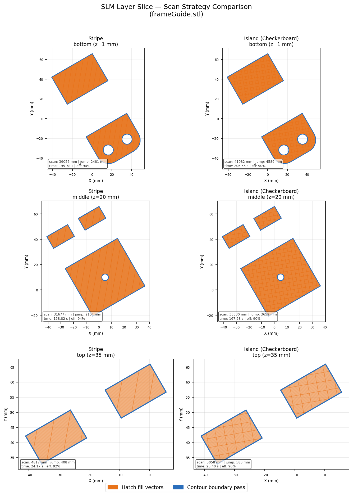
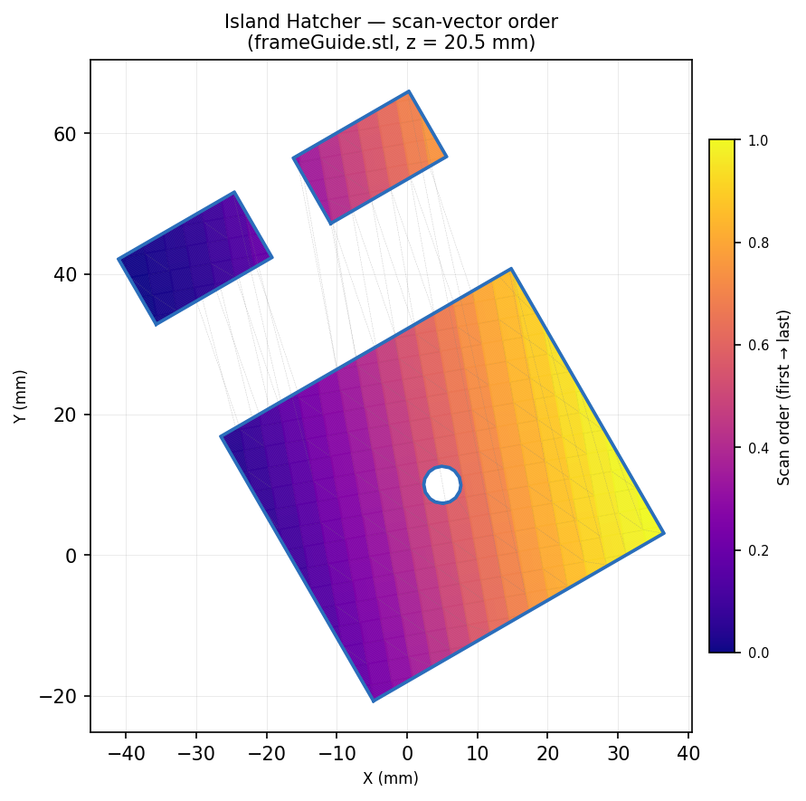
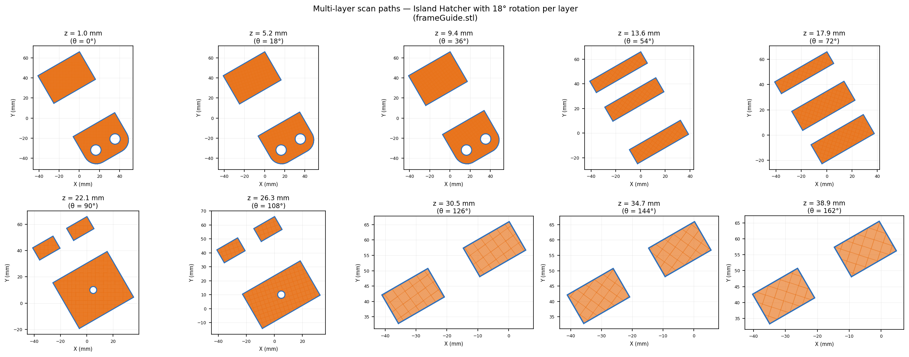

# OpenSLM Slicer

A Python portfolio project exploring pre-processing algorithms for **Selective Laser Melting (SLM)** — a powder-bed metal Additive Manufacturing (AM) process used for printing stainless steel, titanium, aluminium alloys, and other metals layer by layer with a focused laser.

Built on top of the open-source [PySLM](https://github.com/drlukeparry/pyslm) library by Luke Parry.

---

## What this project demonstrates

| Domain | Skill |
|--------|-------|
| Computational geometry | Mesh slicing, polygon offsetting, Clipper-based Boolean operations |
| AM process knowledge | Hatch strategies, BuildStyle parameters, support structures |
| Scientific Python | NumPy, Shapely, Trimesh, Matplotlib |
| Software architecture | Class hierarchies, document-graph pattern, iterator protocol |
| Performance | Multiprocessing for layer-parallel slicing, Cython/C++ extension usage |

---

## The SLM pre-processing pipeline

```
STL mesh
   │
   ▼
Part  ──── orient, scale, dropToPlatform()
   │
   ▼
getVectorSlice(z)  ──── Trimesh Boolean intersection → Shapely polygons
   │
   ▼
Hatcher.hatch()  ──── contour offsets + infill vectors via PyClipper
   │                  strategies: Stripe | Island | Custom sinusoidal
   ▼
Layer  ──── ContourGeometry + HatchGeometry (x0,y0→x1,y1 pairs)
   │
   ├── BuildStyle  ── laser power (W), scan speed (mm/s), spot size (µm)
   │
   ├── analysis  ── path length, jump distance, build-time estimate
   │
   ├── export  ── Renishaw MTT | EOS SLI | DMG Mori REA | SLM Solutions
   │
   └── visualise  ── Matplotlib scan-vector plots, exposure heatmaps
```

---

## Example slice outputs

All images below are generated from `frameGuide.stl` (41 mm tall) by `generate_docs_images.py`.

### Strategy comparison — Stripe vs Island at three layer heights

Orange lines = hatch infill vectors · Blue lines = contour boundary passes



Both strategies use the same laser parameters (200 W, 200 mm/s, 0.08 mm hatch offset).
The island hatcher breaks the layer into 3×3 mm checkerboard cells and scans them in a
randomised order, distributing thermal energy more evenly than the stripe approach.

---

### Scan-vector order visualisation — Island hatcher at z = 20 mm

Colour encodes execution order (purple = first, yellow = last).
Dashed grey lines are jump moves (laser off, repositioning).



**Measured stats for this layer** (z = 20.5 mm, island hatcher, AlternateSort):

| Metric | Value |
|--------|-------|
| Total scan path | 41 082 mm |
| Total jump distance | 4 589 mm |
| Estimated layer time | 206 s |
| Scan efficiency | **90 %** |

A 90 % efficiency means the laser is actively melting material for 9 out of every 10 mm
of motion — well within the acceptable range for industrial SLM.

---

### Multi-layer stack — 10 layers, hatch angle rotated 18° per layer



Rotating the hatch angle each layer is standard practice on commercial SLM machines
(e.g. EOS uses 67°, Renishaw uses 33°). It prevents columnar grain growth aligned
with the scan direction, which would otherwise create anisotropic mechanical properties.

---

## Repository layout

```
.
├── main.py                    # Annotated end-to-end demo
├── generate_docs_images.py    # Script that produced the images above
├── docs/images/               # Generated slice visualisations
├── pyslm/                     # PySLM library (git submodule, LGPL-2.1)
│   ├── pyslm/
│   │   ├── core.py            # Part, DocumentObject, dependency graph
│   │   ├── geometry/          # Layer, BuildStyle, Model data classes
│   │   ├── hatching/          # Hatch strategies + sorting algorithms
│   │   ├── support/           # Block/truss support structure generation
│   │   ├── analysis/          # Build-time estimation, scan iterators
│   │   ├── visualise.py       # Matplotlib rendering helpers
│   │   └── export.py          # Machine build-file exporters
│   ├── examples/              # 17 runnable example scripts
│   └── models/                # Sample STL files (frameGuide.stl, etc.)
└── LICENSE                    # MIT (this wrapper) | LGPL-2.1 (pyslm submodule)
```

---

## Quick start

```bash
# 1. Clone with the pyslm submodule
git clone --recurse-submodules https://github.com/stephen211111/openslm-slicer.git
cd openslm-slicer

# 2. Create a virtual environment and install dependencies
python -m venv venv
source venv/bin/activate        # Windows: venv\Scripts\activate
pip install "numpy<2" PythonSLM trimesh shapely matplotlib

# 3. Run the annotated demo
python main.py

# 4. Regenerate the documentation images
python generate_docs_images.py
```

> **Note on NumPy version:** PySLM's compiled extensions (PyClipper) require
> NumPy < 2. Install `numpy<2` before the other packages to avoid
> `_ARRAY_API not found` errors from Shapely.

---

## Key concepts explained

### Hatch strategies

| Strategy | Description | Use case |
|----------|-------------|----------|
| `StripeHatcher` | Parallel stripes; limits max scan-vector length | General-purpose; minimises long vectors that cause warping |
| `BasicIslandHatcher` | Checkerboard grid; randomised island order | Distributes heat; preferred for complex, dense geometries |
| Custom (sinusoidal) | User-defined curved scan paths | Research into novel strategies |

### Scan-vector sorting

After hatching, vectors are reordered to minimise the **jump distance** (laser-off repositioning moves):

| Algorithm | Behaviour |
|-----------|-----------|
| `AlternateSort` | Reverses direction on every other vector (bidirectional) |
| `LinearSort` | Sweeps monotonically in one direction |
| `FlipSort` | Groups vectors by proximity |

### BuildStyle parameters

| Parameter | Typical range | Effect |
|-----------|--------------|--------|
| `laserPower` | 100–400 W | Melt pool size and depth |
| `laserSpeed` | 200–2000 mm/s | Energy density (J/mm³) |
| `spotCompensation` | 0.04–0.1 mm | Dimensional accuracy |
| `pointDistance` | 20–80 µm | Exposure point overlap (pulsed mode) |
| `jumpSpeed` | 2000–7000 mm/s | Repositioning speed (no lasing) |

---

## License

- `main.py`, `generate_docs_images.py`, `README.md` and all files in this wrapper: **MIT License** — see [LICENSE](LICENSE)
- `pyslm/` submodule: **GNU Lesser General Public License v2.1** — see [pyslm/LICENSE](pyslm/LICENSE)

Original PySLM library © Luke Parry — https://github.com/drlukeparry/pyslm
